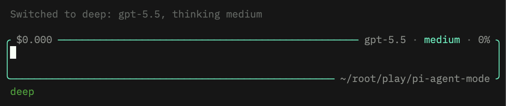
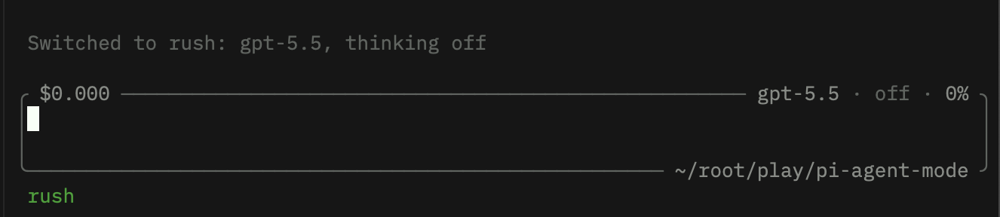
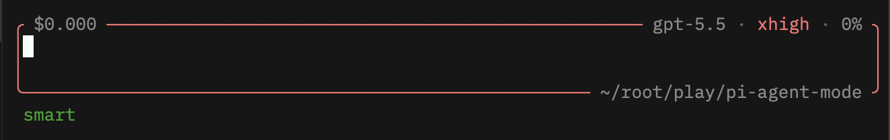

# pi-amplike-modes

Amp-like quick mode switching for [Pi](https://pi.dev): jump between `deep`, `rush`, and `smart` coding modes without opening the model picker.

This extension is intentionally distributed from GitHub, not npm.

## Recommended setup

The screenshots below use [`amp-themes`](https://pi.dev/packages/amp-themes). Install it first if you want the same visual style:

```bash
pi install npm:amp-themes
```

Then install this extension from GitHub:

```bash
pi install git:github.com/msharran/pi-amplike-modes
```

Restart Pi, or run `/reload` if Pi is already open.

## Preview

### Deep mode

`deep` is the balanced default for normal coding work.



### Rush mode

`rush` turns thinking off for fast, lightweight edits.



### Smart mode

`smart` uses the highest thinking level for harder tasks.



## Modes

| Mode | Default model | Thinking level | Use it for |
| --- | --- | --- | --- |
| `deep` | `openai-codex/gpt-5.5` | `medium` | Everyday coding and review |
| `rush` | `openai-codex/gpt-5.5` | `off` | Quick fixes and low-latency edits |
| `smart` | `openai-codex/gpt-5.5` | `xhigh` | Complex debugging, planning, and architecture |

The active mode is shown in the Pi footer/status area.

## Usage

- Press `Alt+M` or `F8` to cycle `deep → rush → smart`.
- Run `/agent-mode deep`, `/agent-mode rush`, `/agent-mode smart`, or `/agent-mode toggle`.

`/agent-mode` is the only slash command registered by this extension.

## Configuration

Mode settings are read from `~/.pi/agent/modes.json`. If the file does not exist, the extension uses the defaults shown below.

Create or edit `~/.pi/agent/modes.json` to customize providers, models, thinking levels, and labels:

```json
{
  "version": 1,
  "currentMode": "deep",
  "modes": {
    "deep": {
      "provider": "openai-codex",
      "modelId": "gpt-5.5",
      "thinkingLevel": "medium",
      "label": "deep"
    },
    "rush": {
      "provider": "openai-codex",
      "modelId": "gpt-5.5",
      "thinkingLevel": "off",
      "label": "rush"
    },
    "smart": {
      "provider": "openai-codex",
      "modelId": "gpt-5.5",
      "thinkingLevel": "xhigh",
      "label": "smart"
    }
  }
}
```

## Distribution

This package is meant to be installed as a Git-backed Pi package:

```bash
pi install git:github.com/msharran/pi-amplike-modes
```

The Pi package gallery currently lists packages published to npm with the `pi-package` keyword. Since this project is intentionally Git-only, it may not appear in the Pi package catalog.

## Contributing

1. Clone the repository:

   ```bash
   git clone https://github.com/msharran/pi-amplike-modes.git
   cd pi-amplike-modes
   ```

2. Test the package without installing it permanently:

   ```bash
   pi -e .
   ```

3. Or install your local checkout while developing:

   ```bash
   pi install "$PWD"
   ```

4. Reload Pi after changes with `/reload`, or restart Pi if needed.

5. Validate packaging and formatting before opening a pull request:

   ```bash
   npm_config_cache="$(mktemp -d)" npm pack --dry-run
   git diff --check
   ```
